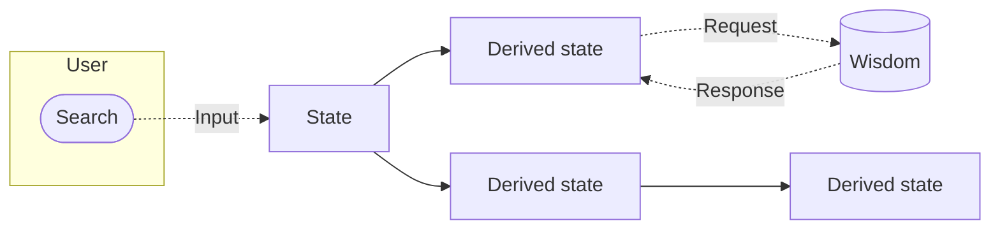

# Introduction

Stan (Polish for "state") builds on ideas from [Recoil](https://recoiljs.org) and [Jotai](https://jotai.org), without getting bogged down by questionable extras. Rather than chasing edge cases, it focuses on proven, battle-tested patterns. Despite its minimal footprint, it's fully capable of handling everything from your TODO lists to the Large Hadron Collider at CERN.

Key Features:

- **Type-safe**. Stan harnesses the power of generics and type inference to deliver a great developer experience.
- **Simple**. A minimal yet sufficient API.
- **Composable**. Stan lets you build both flat and deeply nested state graphs. These update efficiently thanks to caching and subscription tracking.
- **Framework-agnostic**. While Stan can theoretically work with any framework, it depends on none.

## How Stan compares

Here's how Stan stacks up against other popular state-management libraries.

| Library                                       | Model                                                 | Bundle  | Framework support                                                  | Caching                                            | Update granularity               | DevTools                                        | Alive |
| --------------------------------------------- | ----------------------------------------------------- | ------- | ------------------------------------------------------------------ | -------------------------------------------------- | -------------------------------- | ----------------------------------------------- | ----- |
| **Stan**                                      | Atoms + selectors as scoped factory functions         | 2.2 KB  | Framework-agnostic (React and Vue adapters today; more on the way) | `selectorFamily`: `keep-all`, `most-recent`, `lru`, TTL    | Fine-grained                     | Dedicated Chrome extension                      | ✅    |
| [Recoil](https://recoiljs.org)                | Atoms + selectors                                     | 22.7 KB | React only                                                         | `selectorFamily` cache policies                    | Fine-grained                     | No official extension                           | ❌    |
| [Jotai](https://jotai.org)                    | Atomic, bottom-up composition for React               | 3.8 KB  | React only                                                         | Atom-level memoization; `atomFamily` by param      | Fine-grained                     | `jotai-devtools` package (no browser extension) | ✅    |
| [Zustand](https://zustand.docs.pmnd.rs)       | Single hook-based store with slices                   | 0.5 KB  | React-first; framework-agnostic core via `zustand/vanilla`         | Not built-in (user-managed)                        | Store-level (slice selectors)    | Via Redux DevTools middleware                   | ✅    |
| [Redux Toolkit](https://redux-toolkit.js.org) | Single store, actions, reducers (Flux)                | 13.3 KB | Framework-agnostic; React via `react-redux`                        | Via `createSelector` (re-exported from `reselect`)                  | Store-level (memoized selectors) | Redux DevTools (browser extension)              | ✅    |
| [TanStack Store](https://tanstack.com/store)  | Immutable reactive store with computed derived values | 2.2 KB  | Framework-agnostic (React, Vue, Solid, Svelte, Angular adapters)   | Auto-tracked derivations; no formal cache policies | Fine-grained                     | In alpha         | ✅    |

_Bundle sizes are from [Bundlephobia](https://bundlephobia.com) (min+gzip, core package only)._
